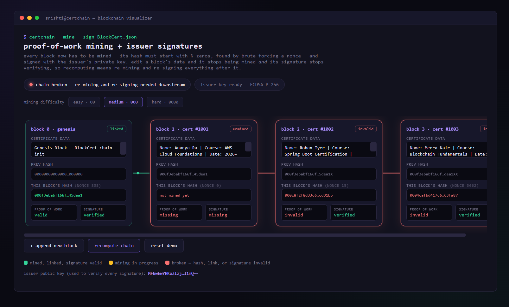

# ⛓️ Basic Blockchain Visualizer

> **Don't just learn blockchain. See how it works. 👀**

A simple **HTML-based blockchain visualization** created to make the basic concepts of blockchain easier to understand through a visual interface.

This project demonstrates how blocks are connected using **hashes and previous hashes**, and how modifying data can affect the integrity of the chain.

---

## 🖥️ Preview

<!-- Add your screenshot here -->

<p align="center">
  
</p>

---

## ⚡ What You'll See

🧱 **Blocks** — How information is stored in a block
🔐 **Hash** — A unique identifier generated for each block
🔗 **Previous Hash** — Connects one block to the previous block
⛓️ **Blockchain** — Multiple blocks linked together
💥 **Tampering** — See how changing data can affect the chain

---

## 🧠 The Basic Idea

Each block contains information such as:

```text
┌──────────────────────┐
│       BLOCK #1       │
│                      │
│  Data                │
│  Hash                │
│  Previous Hash       │
└──────────┬───────────┘
           ↓
┌──────────────────────┐
│       BLOCK #2       │
│                      │
│  Data                │
│  Hash                │
│  Previous Hash       │
└──────────┬───────────┘
           ↓
        BLOCK #3
```

The **previous hash** connects each block to the one before it.

So if the data inside a block is changed:

**Data changes → Hash changes → Chain becomes invalid ⚠️**

That's the basic idea behind **blockchain immutability**.

---

## 🛠️ Built With

* 🌐 HTML
* 🎨 CSS
* ⚡ JavaScript

> Everything is contained in a **single HTML file** — no frameworks or complicated setup required.

---

## ▶️ Run It

Clone the repository:

```bash
git clone <your-repository-url>
```

Open the project folder and simply open:

```text
index.html
```

in your browser.

That's it. 🚀

---

## 🎯 Why This Project?

Blockchain concepts can feel confusing when you only learn them theoretically.

This project was created as a **visual learning experiment** to understand how blocks, hashes, and blockchain connections work together.

---

## 🔮 Future Ideas

* ⛏️ Add mining simulation
* 🔐 Add adjustable mining difficulty
* 💥 Add interactive tampering
* 🔄 Add block validation animations
* 🌐 Expand into a more complete blockchain simulator

---

## ⭐ If You Found It Useful

Feel free to **star ⭐ the repository** and explore the code!

### ⛓️ One block at a time. One concept at a time.
